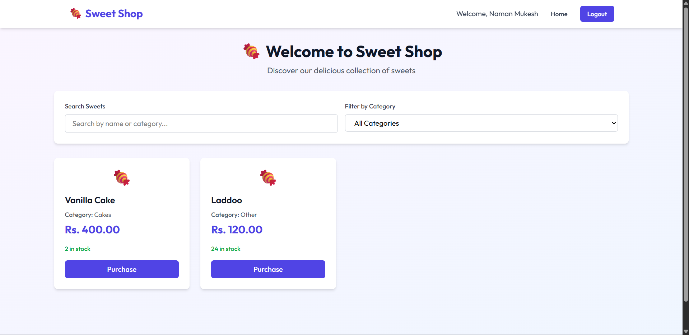
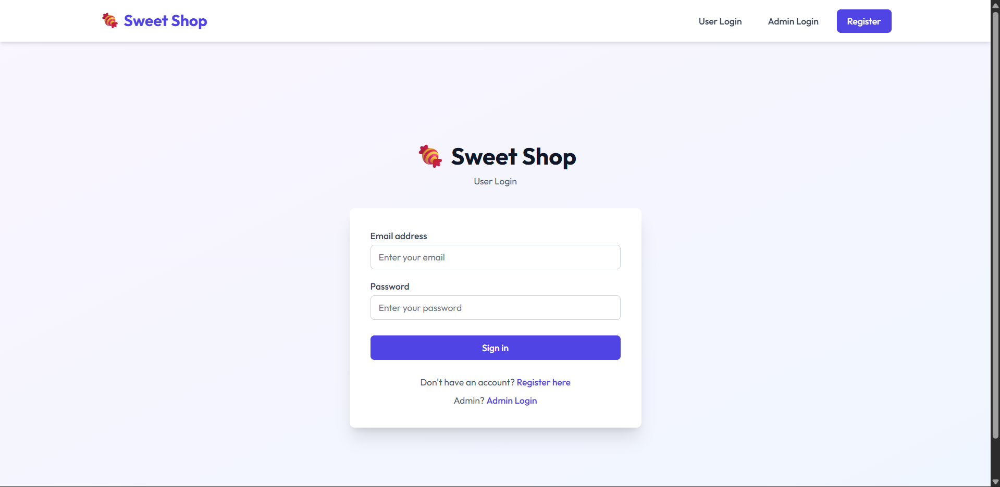
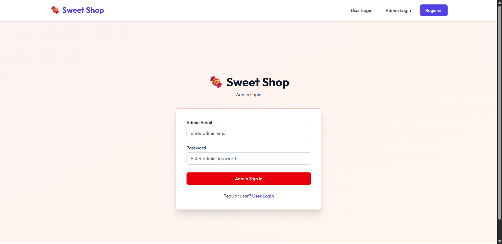
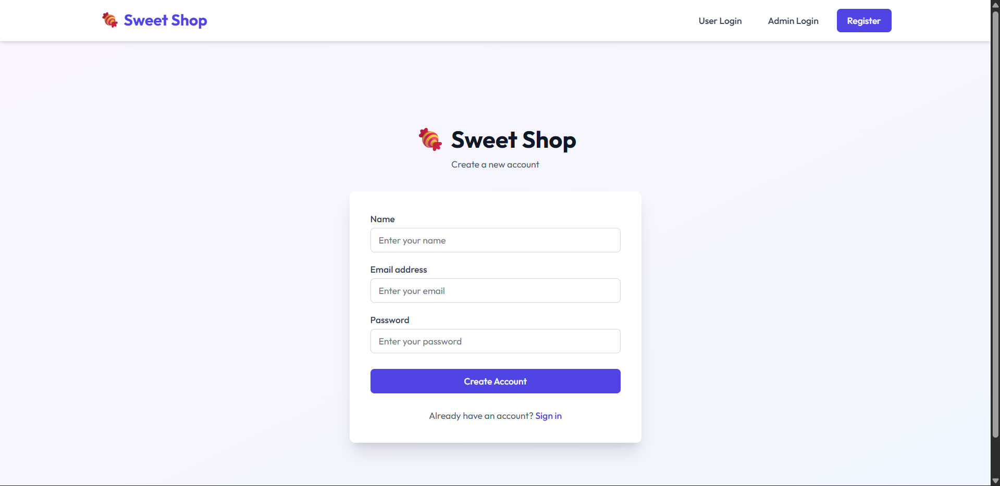
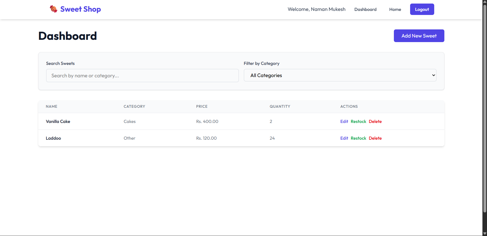

# 🍬 Sweet Shop Management System

A full-stack web application for managing a sweet shop inventory, built with React and Node.js. This system allows users to browse and purchase sweets, while administrators can manage inventory, add new products, and track sales.

## 📋 Table of Contents

- [Project Overview](#project-overview)
- [Features](#features)
- [Tech Stack](#tech-stack)
- [Project Structure](#project-structure)
- [Prerequisites](#prerequisites)
- [Installation & Setup](#installation--setup)
- [Environment Variables](#environment-variables)
- [Running the Application](#running-the-application)
- [API Endpoints](#api-endpoints)
- [Screenshots](#screenshots)
- [Deployment](#deployment)
- [My AI Usage](#my-ai-usage)
- [Contributing](#contributing)
- [License](#license)

## 🎯 Project Overview

The Sweet Shop Management System is a comprehensive solution for managing a sweet shop's operations. It provides:

- **User Management**: Registration, login, and authentication with role-based access control
- **Product Management**: CRUD operations for sweets with categories, pricing, and inventory tracking
- **Shopping Features**: Browse, search, filter, and purchase sweets
- **Admin Dashboard**: Complete inventory management with restocking capabilities
- **Real-time Updates**: Dynamic inventory updates on purchases and restocks

## ✨ Features

### User Features
- 🔐 User registration and authentication
- 🛍️ Browse available sweets with search and filter functionality
- 🛒 Purchase sweets (reduces inventory automatically)
- 🔍 Search sweets by name or category
- 📱 Responsive design for all devices

### Admin Features
- 👤 Admin login with separate authentication
- ➕ Add new sweet products
- ✏️ Edit existing products
- 🗑️ Delete products
- 📦 Restock inventory
- 📊 View all products in a comprehensive dashboard
- 🔒 Protected routes with role-based authorization

### Technical Features
- JWT-based authentication
- Password hashing with bcrypt
- RESTful API architecture
- MongoDB database with Mongoose
- CORS enabled for cross-origin requests
- Error handling and validation
- Toast notifications for user feedback

## 🛠️ Tech Stack

### Frontend
- **React 19.2.3** - UI library
- **Vite 7.2.4** - Build tool and dev server
- **React Router DOM 7.10.1** - Client-side routing
- **Axios 1.13.2** - HTTP client
- **Tailwind CSS 4.1.18** - Utility-first CSS framework
- **React Hot Toast 2.6.0** - Toast notifications

### Backend
- **Node.js** - Runtime environment
- **Express.js 4.21.1** - Web framework
- **MongoDB** - NoSQL database
- **Mongoose 8.7.0** - MongoDB object modeling
- **JWT (jsonwebtoken 9.0.2)** - Authentication tokens
- **bcryptjs 2.4.3** - Password hashing
- **CORS 2.8.5** - Cross-origin resource sharing
- **dotenv 16.4.5** - Environment variable management

## 📁 Project Structure

```
Sweets Shop Management System/
├── Client/                    # Frontend React application
│   ├── public/               # Static assets
│   ├── src/
│   │   ├── components/       # Reusable components
│   │   │   └── navbar.jsx
│   │   ├── context/          # React Context API
│   │   │   └── AppContext.jsx
│   │   ├── hooks/            # Custom React hooks
│   │   │   └── useAuth.js
│   │   ├── pages/            # Page components
│   │   │   ├── Home.jsx
│   │   │   ├── Dashboard.jsx
│   │   │   ├── UserLogin.jsx
│   │   │   ├── AdminLogin.jsx
│   │   │   └── Register.jsx
│   │   ├── App.jsx           # Main app component
│   │   ├── main.jsx          # Entry point
│   │   └── index.css         # Global styles
│   ├── package.json
│   └── vite.config.js
│
├── Server/                    # Backend Express application
│   ├── Controllers/          # Request handlers
│   │   ├── auth.controller.js
│   │   └── sweet.controller.js
│   ├── DB/                   # Database configuration
│   │   └── index.js
│   ├── Middlewares/          # Custom middleware
│   │   ├── auth.middleware.js
│   │   └── authorize.middleware.js
│   ├── Models/               # Mongoose models
│   │   ├── User.model.js
│   │   └── Sweet.model.js
│   ├── Routes/               # API routes
│   │   ├── auth.routes.js
│   │   └── sweet.routes.js
│   ├── Utils/                # Utility functions
│   │   └── jwt.utils.js
│   ├── index.js              # Server entry point
│   └── package.json
│
└── README.md
```

## 🚀 Installation & Setup

### Step 1: Clone the Repository

```bash
git clone <https://github.com/NamanMukesh/Sweet-Shop-Management-System>
cd "Sweets Shop Management System"
```

### Step 2: Backend Setup

1. Navigate to the Server directory:
```bash
cd Server
```

2. Install dependencies:
```bash
npm install
```

3. Create a `.env` file in the Server directory:
```bash
touch .env
```

4. Add the following environment variables to `.env`:
```env
# Server Configuration
PORT=5000
NODE_ENV=development

# Database Configuration

# PORT=5000
# MONGODB_URI=******************************************************
# JWT_SECRET=**********
```

### Step 3: Frontend Setup

1. Navigate to the Client directory (from project root):
```bash
cd ../Client
```

2. Install dependencies:
```bash
npm install
```

3. Create a `.env` file in the Client directory:
```bash
touch .env
```

4. Add the following environment variable to `.env`:
```env
VITE_API_BASE_URL=http://localhost:5000
```

## 🏃 Running the Application

### Start the Backend Server

1. Navigate to the Server directory:
```bash
cd Server
```

2. Start the development server:
```bash
npm run dev
```

The server will start on `http://localhost:5000`

### Start the Frontend Application

1. Open a new terminal and navigate to the Client directory:
```bash
cd Client
```

2. Start the development server:
```bash
npm run dev
```

The frontend will start on `http://localhost:5173`

### Access the Application

Open your browser and navigate to:
- **Frontend**: http://localhost:5173
- **Backend API**: http://localhost:5000


## 📡 API Endpoints

### Authentication Routes (`/api/auth`)

| Method | Endpoint | Description | Auth Required |
|--------|----------|-------------|---------------|
| POST | `/api/auth/register` | Register a new user | No |
| POST | `/api/auth/login` | Login user | No |
| GET | `/api/auth/me` | Get current user | Yes |

### Sweet Routes (`/api/sweets`)

| Method | Endpoint | Description | Auth Required | Admin Only |
|--------|----------|-------------|---------------|------------|
| GET | `/api/sweets` | Get all sweets | No | No |
| GET | `/api/sweets/search` | Search sweets | No | No |
| GET | `/api/sweets/:id` | Get sweet by ID | No | No |
| POST | `/api/sweets` | Create new sweet | Yes | Yes |
| PUT | `/api/sweets/:id` | Update sweet | Yes | Yes |
| DELETE | `/api/sweets/:id` | Delete sweet | Yes | Yes |
| POST | `/api/sweets/:id/purchase` | Purchase sweet | Yes | No |
| POST | `/api/sweets/:id/restock` | Restock sweet | Yes | Yes |


## 📸 Screenshots

### Home Page - Sweet Catalog

*Browse available sweets with search and filter functionality*

### User Login

*User authentication page*

### Admin Login

*User authentication page*

### Register

*User authentication page*

### Admin Dashboard

*Admin panel for managing inventory*

### Live Application

🔗 **Live Application**: [https://sweet-shop-management-system-lilac.vercel.app/](https://sweet-shop-management-system-lilac.vercel.app/)

## 🤖 My AI Usage

This project was developed with the assistance of AI tools, primarily using **Cursor AI** and **Claude (Anthropic)**. The AI was used for:

### Development Assistance
- **Code Generation**: React components
- **Bug Fixing**: Debugging authentication issues, CORS configuration, and API endpoint problems


### Specific AI Contributions
1. **CORS Configuration**: AI helped configure CORS middleware to support all origins and resolve deployment issues
2. **Error Handling**: Added comprehensive error handling across controllers and middleware
3. **State Management**: Help in setting up React Context API for global state management


### AI Tools Used
- ChatGPT
- Claude

### Learning Outcomes
Working with AI tools helped accelerate development while learning:
- Modern React patterns and hooks
- Fast Error Handling
